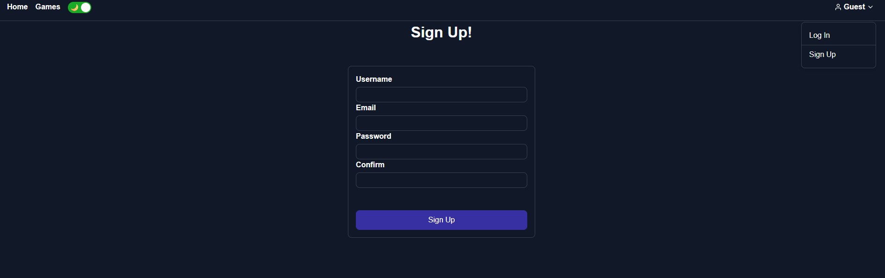
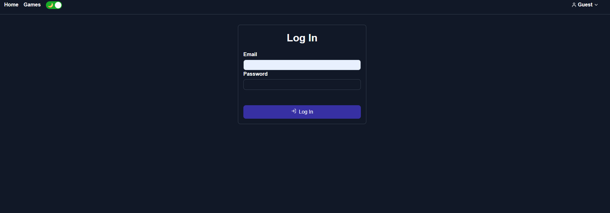
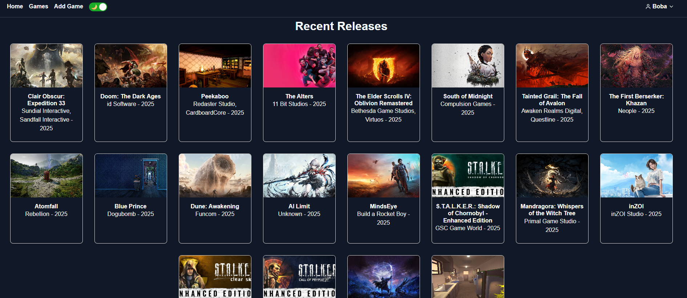
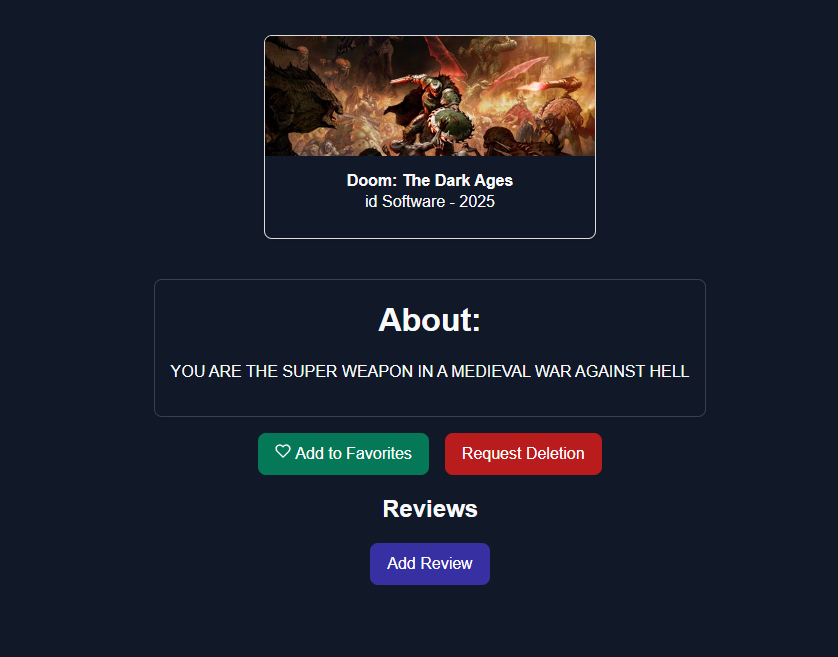
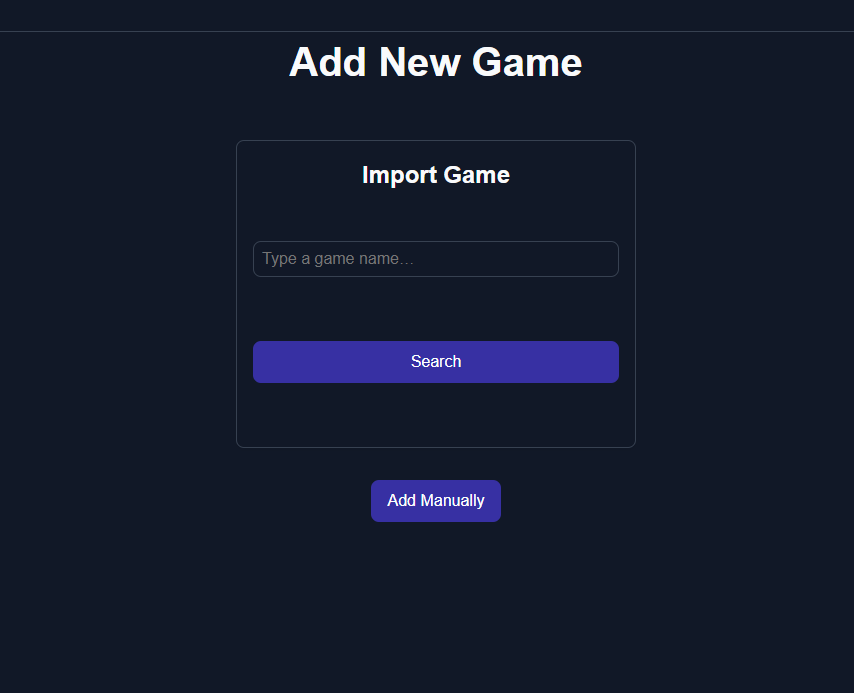

# Game Club

A full-stack “game club” web app where players can discover games (via RAWG), add their own entries, write reviews, and favorite their games.  

Key features:
- Browse & search games by title or fetch from the RAWG API  
- Registered users can add new games, write/edit/delete their reviews, and maintain a list of favorites   
- User profiles exposing each user’s favorites and their username  
- Light / dark mode toggle with persisted preference  

---

## Screenshots
*Sign up Page*  

*Log in Page*  

*Landing*  

*Game Detail (with reviews, favorites, flagging)*  

*Import Games*  

*Manual Add Game Form*  

---

## Technologies Used/Attributions

- **Frontend**  
  - React 
  - React Router 
  - React Icons 
  - React Responsive  
  - React Toggle
  - CSS 
  - Favicon Generator
- **Backend**  
  - Node.js + Express  
  - MongoDB + Mongoose  
  - JSON Web Tokens for auth  
  - bcrypt for password hashing  
  - Morgan, dotenv, CORS  
- **APIs**  
  - RAWG API for game data imports  

---

## Future Improvements
- Pagination & advanced filters on game lists
- Upload / serve custom cover images
- Social features: comments on reviews, follow users
---

## Getting Started
[Project Planning!](https://trello.com/b/Oz1C6uYE/game-club)

[View the App Here](https://game-club-7dfc89d36c85.herokuapp.com/)