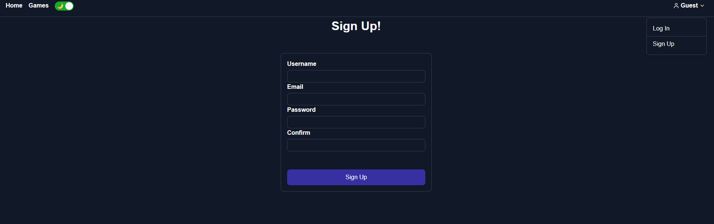
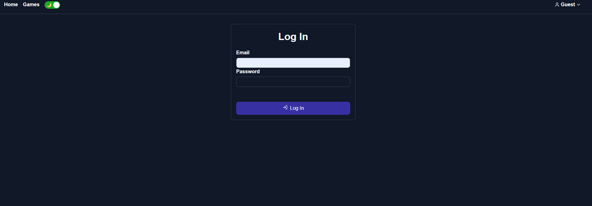
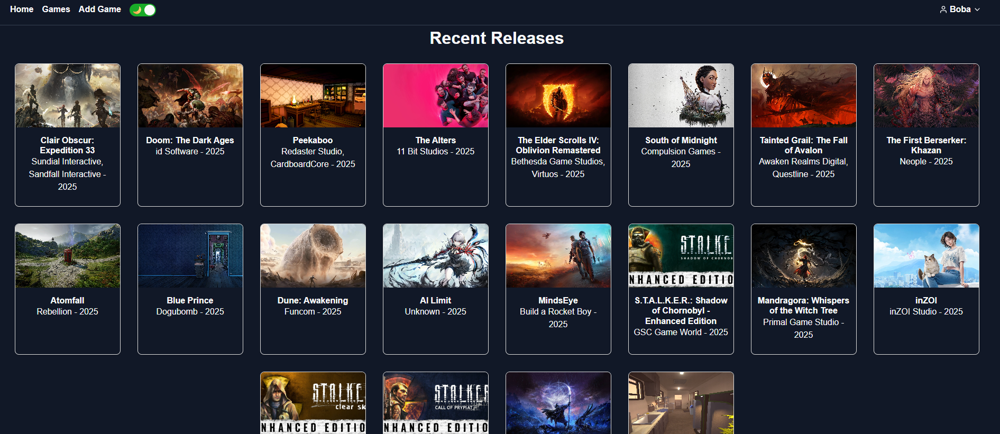
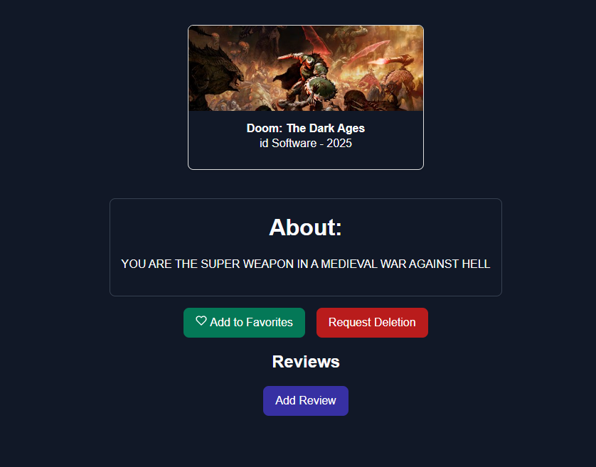
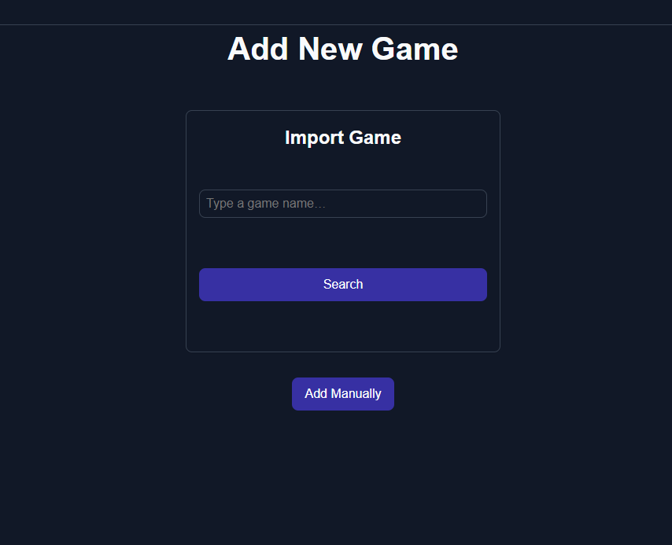

# Game Club 🎮🌐  

_A social hub for gamers to discover, share, and review video games with a clean, modern UI._  

---

## 🌟 Overview
**Game Club** is a full-stack MERN application that blends **community interaction** with **game discovery**. Powered by the **RAWG API**, it allows players to import, explore, and manually add games while also leaving reviews, favoriting titles, and browsing collections. With personalized theming and secure authentication, Game Club is a showcase of both functionality and style.  

---

## ✨ Features
- 🔍 **Discover & Search** — browse games via the RAWG API or add custom entries  
- 📝 **Player Reviews** — write, edit, and manage reviews with community feedback  
- ⭐ **Favorites & Profiles** — curate favorites and view other players’ collections  
- 🌗 **Light/Dark Mode** — theme toggle with saved preference  
- 🔐 **Secure Auth** — JWT-based authentication with password hashing  

---

## 🖼️ Screenshots
- **Sign Up Page**  

- **Log In Page**  

- **Landing Page**  

- **Game Detail (reviews, favorites, flagging)**  

- **Import Games from RAWG**  

- **Manual Add Game Form**  
  

---

## 🛠️ Technologies
  
### Frontend
- React  
- React Router  
- React Icons  
- React Responsive  
- React Toggle  
- CSS  
- Favicon Generator  

### Backend
- Node.js + Express  
- MongoDB + Mongoose  
- JWT Authentication (jsonwebtoken, bcrypt)  
- Morgan, dotenv, CORS  

### Other
- **RAWG API** (game data & cover art)  
- Heroku (deployment)  

---

### 🔮 Future Improvements
- 📑 Pagination & advanced filters on game lists  
- 🖼️ Upload / serve custom cover images  
- 👥 Social features: comments on reviews, follow users  

---

## Try It Here!

  

---

## 🚀 Project Planning
